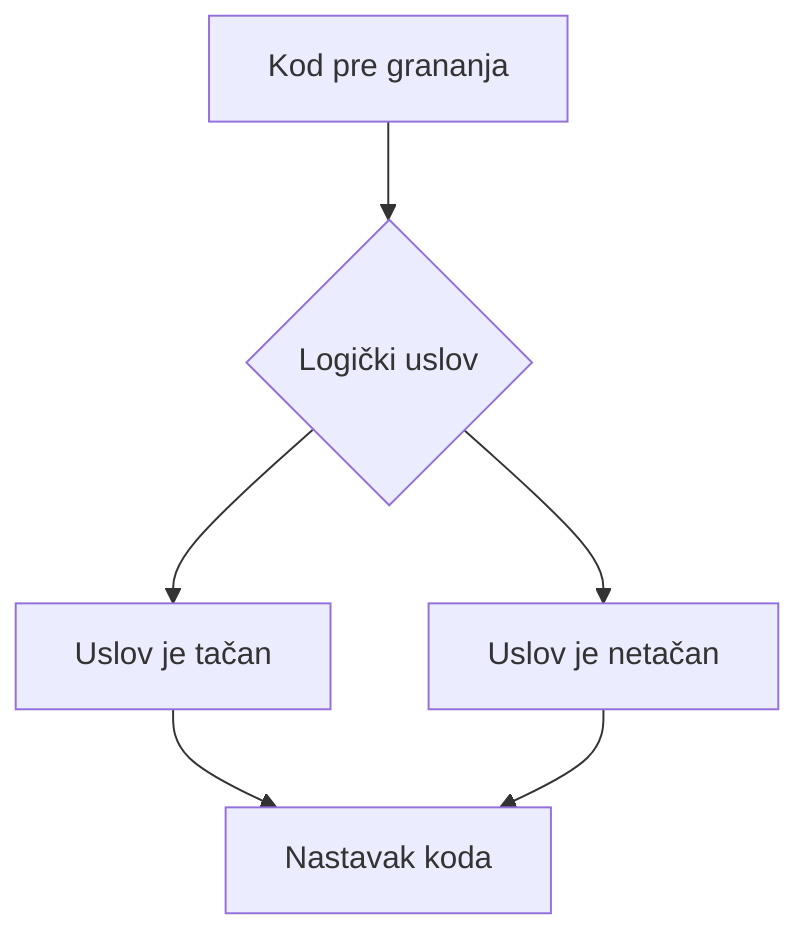
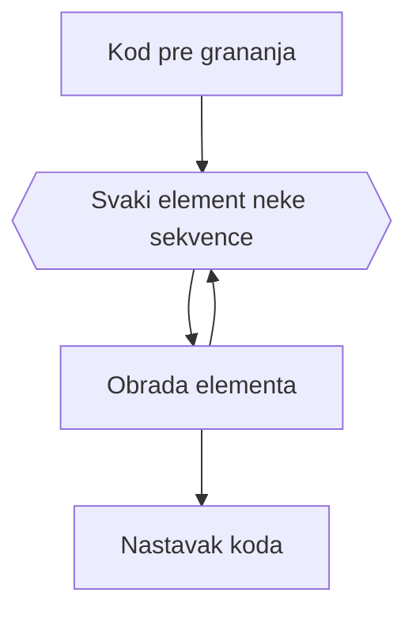

# `if` i `for`

Prvi korak u uvođenju ozbiljnije logike u naš program je grananje toka izvšavanja i ponovno izvršavanje određenog dela koda. Ovo se omogućava kroz `if` grananja i `for` petlje.

## `if` grananja

Osnovni princip grananja je da se određenim logičkim uslovom određuje koji deo koda će se izvršiti.

## `for` petlje

Princip petlje je da se dok se ne obradi svaki element neke sekvence izvršava neko određeno parče koda.

Python dokumentacija: [link](https://docs.python.org/3.13/tutorial/controlflow.html)
